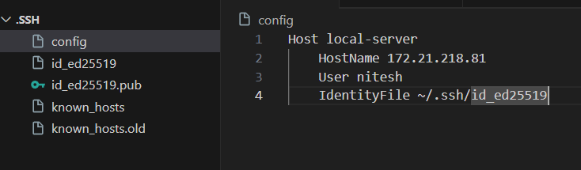

## Check if SSH is installed or not
1) ssh -V
2) dpkg -l | grep openssh-client
3) dpkg -l | grep openssh-server

## SSH installation
1) sudo apt update
2) sudo apt install openssh-server

## Check SSH server status
1) sudo systemctl status ssh

## Start SSH server
1) sudo systemctl start ssh
2) sudo systemctl enable ssh

### Allow Firewall to connect SSH
1) sudo ufw allow ssh

## Disconnect commnad
1) logout (use to disconnect from linux shell)
2) exit (use to disconnect from windows shell)

## Connection command
1) ssh hostname@ip_address (server hostname and the ip address)
2) Ex- ssh nitesh@172.21.218.81

## username and IP address access
1) hostname -I (give ip address)
2) whoami (give user name)

## SSH Authentication(Access) without using Server password
first, we generate public and private keys at the client side that are store in '_user/.ssh/' by using this command :-

1) ssh-keygen (use to generate public and private keys)

Copy the public key from the client side and store it at the server side in this file '.ssh/authorized_keys'.

Now you can directly access the remote server system by using this command 'ssh username@ip_address' at the client side without using password.

## Accessing Multiple remote server computers using a single client computer

To access multiple computers we follow these steps:-
1) Create a file 'config' in this folder '_user/.ssh' at the client side

2) write this code: 

    

3) Now you can run this command to access the remote server commputer ;- 'ssh local-server'